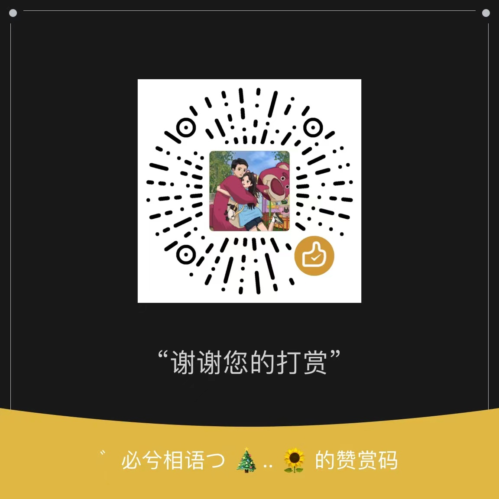

SecUI
==========

基于 [Element UI](https://element.eleme.cn/#/zh-CN) 封装的一套适用于快速搭建后台管理界面的 UI 组件库，功能基本完成，相关文档仍在补充中。

安装
----------

> 请使用私服下载依赖。

```bash
npm install @dbsec/ui -S
```

快速开始
----------

```js
import Vue from 'vue';
import SecUI from '@dbsec/ui';
import '@dbsec/ui/dist/sec-ui.css';

Vue.use(SecUI);
```

> 组件库已将 [Element UI](https://element.eleme.cn/#/zh-CN) 的样式包含进来，无需再单独安装，且可以使用所有的 Element 样式。

> SecUI 绝大部分组件用法都和 Element 保持一致，在原基础上进行了样式调整和功能扩展，大部分情况将组件名的 `el-` 前缀 改为 `sec-` 即可使用。

> 其中，`el-button` 更名为 `sec-btn`、`el-pagination` 更名为 `sec-pager`。

> 另外，`Descriptions`、`Tabs`（`sec-tabs` 另有用法）、`Steps`、`Carousel` 几个组件由于技术原因仍要直接使用 `el-` 前缀，组件库只是把 Element 的几个组件原样引入过来。

> 暂不支持按需加载和国际化及一些功能。

一个个组件整理并优化的，真的很辛苦，求您慷慨解囊打赏一下吧^_^

